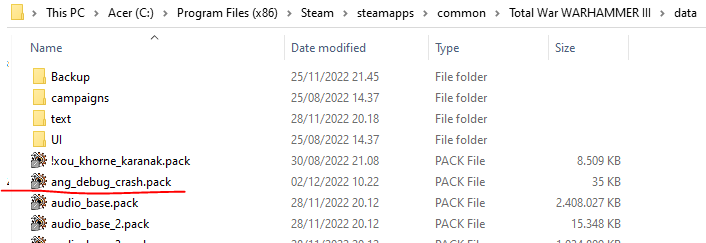
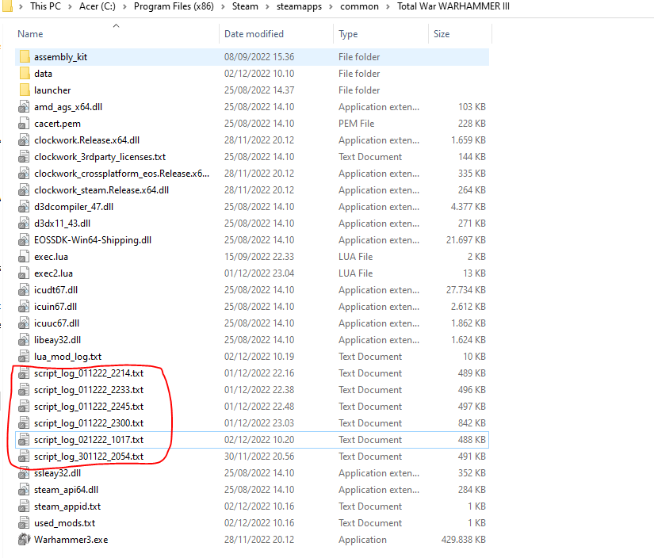
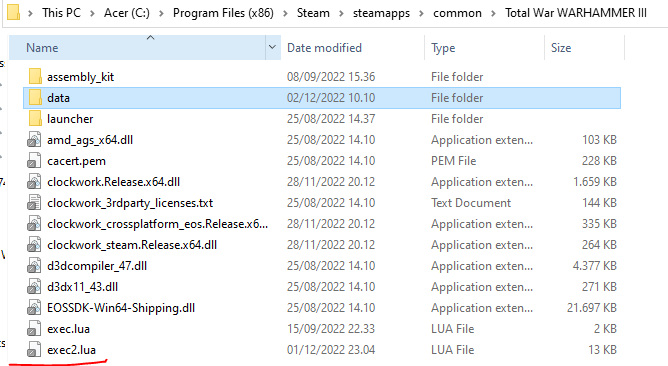

# debug_crash_twh3

## What is this?

This is a mod for Total War Warhammer 3 to help identify which faction is causing the game to crash.

## How to install

Download the latest mod file [here](https://github.com/DasAng/debug_crash_twh3/blob/main/ang_debug_crash.pack).

Place it inside your Total War Warhammer 3 data folder:



## What does it do?

Total War Warhammer 3 has a annoying game crash bug that appears from versions introduced after 2.0.0.

This mod will help troubleshoot which faction is causing the game to crash.

The mod works the following way:

- At the start of each faction's turn it will print out the name of the faction.

    For example if it was the start of the faction **wh2_main_lzd_tlaqua** turn then you should be able to find in the log the following line:
    
    `DEBUG: faction turn start: wh2_main_lzd_tlaqua`

- At the end of each faction's turn it will print out the name of the faction.

    For example if it was the end of the faction **wh2_main_lzd_tlaqua** turn then you should be able to find in the log the following line:
    
    `DEBUG: faction turn end: wh2_main_lzd_tlaqua`

- When the game then crash, you should be able to go find your log files (usually it is in your C:\Program Files (x86)\Steam\steamapps\common\Total War WARHAMMER III).



The log file is named something like the following:

`script_log_xxxx.txt`

where **xxxx** is some digits representing the timestamp. Anyway you can then open the latest log file with notepad or whatever text editor.

Then inside the log file search for the line stating:

`DEBUG: faction turn start:`

An example of when I had a crash for the faction **wh2_main_def_naggarond**:

```
[out] <182.8s>   DEBUG: faction turn end: wh2_main_lzd_tlaqua
[out] <182.8s>    & Removing effect bundle [wh3_main_bundle_force_crackdown_corruption] from military force with cqi [2842]
[out] <182.8s>    & Removing effect bundle [wh3_main_bundle_force_crackdown_corruption] from military force with cqi [3056]
[traits] <182.8s>   * force_add_trait() is adding trait [wh2_main_trait_non_corrupted] to character [character_cqi:45], showing message: true, points: 1
[traits] <182.9s>   * force_add_trait() is adding trait [wh3_main_trait_corrupted_khorne] to character [character_cqi:4181], showing message: true, points: 1
[out] <182.9s>   DEBUG: faction turn start: wh2_main_lzd_itza
[traits] <183.6s>   * force_add_trait() is adding trait [wh2_main_trait_stance_forced_march] to character [character_cqi:45], showing message: true, points: 1
[traits] <183.6s>   * force_add_trait() is adding trait [wh2_main_trait_stance_forced_march] to character [character_cqi:3689], showing message: true, points: 1
[traits] <183.6s>   * force_add_trait() is adding trait [wh2_main_trait_stance_forced_march] to character [character_cqi:4001], showing message: true, points: 1
[traits] <183.6s>   * force_add_trait() is adding trait [wh2_main_trait_stance_forced_march] to character [character_cqi:4181], showing message: true, points: 1
[out] <183.6s>   DEBUG: faction turn end: wh2_main_lzd_itza
[out] <183.6s>    & Removing effect bundle [wh3_main_bundle_force_crackdown_corruption] from military force with cqi [1550]
[out] <183.6s>    & Removing effect bundle [wh3_main_bundle_force_crackdown_corruption] from military force with cqi [3268]
[traits] <183.7s>   * force_add_trait() is adding trait [wh2_main_trait_public_order] to character [character_cqi:4003], showing message: true, points: 1
[out] <183.7s>   DEBUG: faction turn start: wh2_main_def_naggarond
```

As you can see from above log snippets the turn started for faction **wh2_main_def_naggarond** but there is no log statement for the end of turn for that faction.

So something happened during the faction's turn and we never get to the end of the faction's turn.

## What next?

So now that we know which faction causes the crash what can we do to get around it?

Well as of this moment we really don't know the root cause for the crash, so we cannot completely fix it, but what we could do to continue playing is to skip the faction's turn.

This can only be done through scripting. To help with that you can also use a very useful mod named **Console Commands (Modding Tool)**. Subscribe to the that mod from steam workshop and you can run script on the fly in game.

### Skip a factions turn using the Console Commands mod

Once you have subscribed to the **Console Commands (Modding Tool)** mod you need to load your game again with this mod enabled, as of this point you don't really need to enable my **ang_debug_crash** mod anymore. Now follow the following steps:

1. Create a LUA file named "exec2.lua" and place it inside the Total War Warhammer 3 directory:



2. Open the exec2.lua file in any text editor and paste the following contents

```
local f = cm:get_faction("wh2_main_def_naggarond")
cm:set_skip_faction_turn(f, true)
```

You should change the text **wh2_main_def_naggarond** with the faction that actually causes the crash, in my scenario it was the wh2_main_def_naggaron faction.

3. Now in your game you should click on the menu button to open the console command textbox, please see the **Console Commands (Modding Tool)** mod for how to use it.

4. Then type the text **ee** and hit the execution button.

5. What will happen is that the **exec2.lua** file will be executed and the faction mentioned inside the script will have their turn skipped. The faction will have their turn skipped forever, until you set it back.

6. (optional) If you want to enable the faction again then modify the **exec2.lua** file and change the content to like the following:

```
local f = cm:get_faction("wh2_main_def_naggarond")
cm:set_skip_faction_turn(f, false)
```

And execute the script again using step 4.